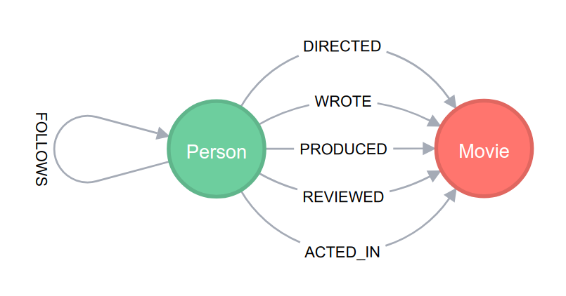

# Moviegraph

_Moviegraph_ is a demo and training application for Python and Neo4j.
The instructions below show how to get set up for the associated training material, part of which is contained within this repository.


## Setup 1: Install Neo4j

The first step is to download and install Neo4j (if you don't already have it).

Download a Neo4j bundle:
```bash
$ wget http://dist.neo4j.org/neo4j-community-3.4.1-unix.tar.gz
```
Unzip the archive:
```bash
$ tar xf neo4j-community-3.4.1-unix.tar.gz
```
Step into the application directory:
```bash
$ cd neo4j-community-3.4.1
```
Set the initial password to `password`:
```bash
$ bin/neo4j-admin set-initial-password password
```
And start the server:
```bash
$ bin/neo4j start
```


## Setup 2: Install a data set

The training requires installation of the Movie Graph data set, which comes bundled with Neo4j  

Once the database is running, open the Neo4j browser at `http://localhost:7474/`.
Then start the Movie Graph guide by typing `:play movies` and pressing `[ENTER]` or clicking the play button `(▶)`.
Follow the instructions to create and explore the data set (but don't delete it as we'll need it later!)

You can also view a "meta graph" that represents the data model itself, showing how node labels and relationship types are connected within the data set.
To do this, run `CALL db.schema` and you should see output similar to the following:




## Setup 3: Install training application

This repository contains the application code used in the training.
You'll need a local copy, which you can clone in the usual way:
```bash
$ git clone https://github.com/neo4j-drivers/moviegraph.git
```
After that, you'll need to create and activate a virtual environment (this requires [virtualenv](https://virtualenv.pypa.io/en/stable/) to be installed):
```bash
$ virtualenv venv
$ source venv/bin/activate
```
And finally, install the project requirements:
```bash
$ pip install -r requirements.txt
```

If you want to use a different language, feel free to convert the code.


## Setup 4: Open the application
```
export FLASK_DEBUG=1
export FLASK_ENV=development
FLASK_APP=moviegraph flask run
http://127.0.0.1:5000
```


## Code walk 1: Project structure

- `answers/` - all the answers!!
- `static/` - static files (css)
- `templates/` - HTML template files (Jinja format)
- `venv` - virtual environment (if setup as above)
- `moviegraph.py` - main application module
- `requirements.txt` - project requirements


## Code walk 2: Flask setup code
```python
from flask import Flask, abort, render_template, request
app = Flask(__name__)
```

## Code walk 3: Neo4j driver setup code
```python
from neo4j.v1 import GraphDatabase
driver = GraphDatabase.driver("bolt://localhost:7687", auth=("neo4j", "password"))
```


## Code walk 4: GET index page
```python
@app.route("/")
def get_index():
    """ Show the index page.
    """
    search_term = request.args.get("q", "")
    with driver.session() as session:
        movies = session.read_transaction(match_movies, q=search_term)
    return render_template("index.html", movies=movies, q=search_term)
```


## Code walk 5: `match_movies` transaction function
```python
def match_movies(tx, q):
    if q:
        return tx.run("MATCH (movie:Movie) WHERE toLower(movie.title) CONTAINS toLower($term) "
                      "RETURN movie ORDER BY movie.year DESCENDING, movie.title ASCENDING", term=q).value()
    else:
        return []
```


## Code walk 6: GET movie page
```python
@app.route("/movie/<title>")
def get_movie(title):
    """ Display details of a particular movie.
    """
    with driver.session() as session:
        record = session.read_transaction(match_movie, title)
    if record is None:
        abort(404, "Movie not found")
    return render_template("movie.html", movie=record["movie"], actors=record["actors"])
```


## Code walk 7: `match_movie` transaction function
```python
def match_movie(tx, title):
    return tx.run("MATCH (movie:Movie) WHERE movie.title = $title "
                  "OPTIONAL MATCH (person)-[:ACTED_IN]->(movie) "
                  "RETURN movie, collect(person) AS actors", title=title).single()
```


## Exercise 1: Add `person` pages
- Add links behind the movie cast list
- Add a new page for `/person/<name>`
- Add a new `person.html` template

```bash
FLASK_APP=answers/1/moviegraph flask run
```


## Exercise 2: Add star ratings
- Add clickable star rating to each movie
- Add handler for POST requests to `/movie/<title>`
- Add transaction function `set_movie_stars`
 
 
## Exercise 3: Improve search page
- Add stars to search results
- Add _order by_ box
